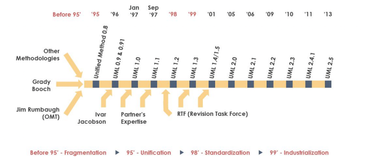

# Apa itu UML?

- Unified Modelling Language (UML) adalah himpunan struktur dan teknik untuk pemodelan desain program berorientasi objek serta aplikasinya.

- UML memiliki bentuk semacam **notasi diagram** yang sifatnya grafis.

- UML **bukan metodologi**, tapi ***alat komunikasi*** untuk mempermudah pengembang untuk memvisualisasikan, memahami, dan mendiskusikan informasi yang disajikan dalam diagram.

- UML **tidak membatasi** hal untuk menghasilkan desain yang diinginkan.

## Sejarah UML

## Fungsi UML

1. Menggambarkan batasan system dan fungsi-fungsi system secara umum.
2. Menggambarkan representasi struktur static sebuah system dalam bentuk ***class diagrams***.
3. Membuat model behavior yang menggambarkan kebiasaan atau sifat sebuah system.
4. Menggambarkan kegiatan atau proses bisnis yang akan dilaksanakan secara umum.

---

UML apa saja yang dipakai ketika mendesain suatu system?

**Sparx (Enterprise Architext):**
1. Use case Diagram
2. Activity Diagram
3. Sequence Diagram
4. Class Diagram
5. Deployment Diagram

**Simon Kendal (University of Sunderland):**
1. Use case Diagram
2. Activity Diagram
3. Sequence Diagram
4. Class Diagram
5. ***Statechart Diagram***

# Sintaks UML

Diagram UML harus menyampaikan informasi yang tepat, ada sintaks yang harus diikuti.

Atribut di UML harus ditampilkan sebagai nama visibilitas dan jenis multiplisitas.

Visiabilitas:

- '+' -> public
- '-' -> private
- '#' -> protected
- '~' -> package

Multiplisitas:

- 'n' -> n
- '*' -> nol atau lebih
- 'm...n' -> antara m dan n

# Jenis asosiasi pada UML

Ada berbagai jenis asosiasi yang dilambangkan dengan panah yang berbeda:

## 1. Dependency

*Depedency* (ketergantungan) merupakan sebuah relasi yang menyebutkan bahwa **peruabahan pada satu class, maka akan mempengaruhi class lain yang menggunakannya, tapi tidak berlaku sebaliknya.**

Pada umumnya, relasi dependency dalam konteks *Class Diagram*, digunakan apabila terdapat satu class yang menggunakan / menginstance class lain **sebagai argumen dari sebuah method.**

Contoh: Bila spesifikasi dari class Channel berubah, maka method playOn pada class FilmClip juga akan berubah.

## 2. Asosiasi

Dalam asosiasi, Class A **menggunakan** objek Class B.

Biasanya Class A memiliki atribut Class B.

Contoh: OrderDetail dapat disusun dari item-nya, namun tidak bisa sebaliknya. Panah ini juga menjelaskan siapa “memiliki” implementasi dari association; dalam kasus ini OrderDetail 
memiliki Item. Association tanpa arah panah merupakan bidirectional (bolak-balik).

