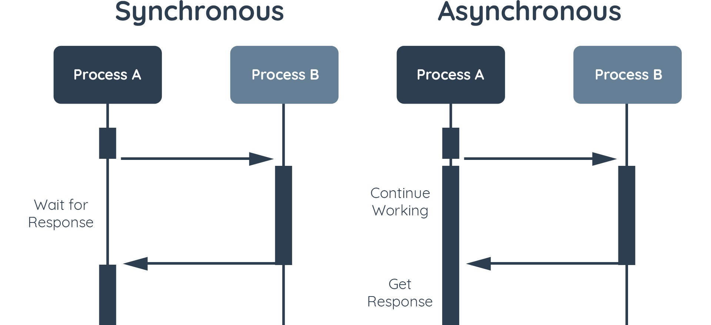

# Synchronous vs Asynchronous

Dalam synchronous program, kode program dijalankan secara berurutan dari atas ke bawah. Artinya jika kita menuliskan dua baris kode maka baris kode kedua tidak bisa dieksekusi sebelum kode baris pertama selesai dieksekusi. Kita bisa bayangkan ketika sedang berada dalam antrian kasir. Kita tidak akan dilayani sebelum semua antrian di depan kita selesai dilayani, begitu pula orang di belakang kita pun harus menunggu gilirannya.

Dalam asynchronous program, jika kita menuliskan dua baris kode, kita dapat membuat baris kode kedua dieksekusi tanpa harus menunggu kode pada baris pertama selesai dieksekusi. Dalam dunia nyata bisa kita bayangkan dengan memesan kopi melalui pelayan, di mana sembari menunggu pesanan kita datang, kita dapat melakukan aktivitas lain seperti membuka laptop atau menulis.

Program asynchronous memungkinkan suatu operasi bisa berjalan sembari menunggu operasi lainnya selesai. Umumnya kita memanfaatkan asynchronous pada operasi yang besar dan membutuhkan waktu lama, seperti mengambil data dari internet atau API, menyimpan data ke database, dan membaca data dari sebuah berkas.